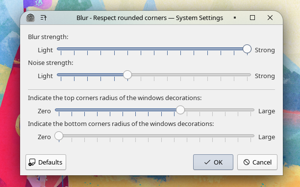

# Kwin blur effect - Respect rounded corners


This kwin effect is a fork of the default kwin blur effect, with minimal changes
to solve the ["plasma kornerbug"](https://bugs.kde.org/show_bug.cgi?id=395725).
It works with all decorations, including aurorae one's, and take care of maximized windows, that are assumed to not have rounded corners.


*Above left : Korner bug with the default blur effect*

*Above right : with the present blur effect*
 
*(Window decorations :  [classikstyles](https://github.com/paulmcauley/classikstyles) by paulmcauly)*

## Usage

After installing the effect, go to Settings --> Workspace behavior --> Desktop Effects.

- Disable the default blur effect ("Blur")
- Enable "Blur - Respect rounded corners"
- Tweak the settings of the effect to match your window decorations.



## Limitations

The effect only acts for window decorations. If the window has a decoration that have to be blurred and is not maximized, the rounded corners area are removed from the region "to be blurred". (before the blur occurs)

It seems to be not compatible with [ligthlyShaders](https://github.com/a-parhom/LightlyShaders) or [shapecorners](https://sourceforge.net/projects/shapecorners/).


## Plasma version

I only tested the effect on plasma 5.23.3, I don't know if it work with older versions (But it should, the changes from the default blur effect are very minimal)

## Installation

### Binary package

If you build a binary package, or make the effect available from the "kde get new stuff" service, let me know ! 

### Build from source

*Section copied from* [Yet another magic lamp](https://github.com/zzag/kwin-effects-yet-another-magic-lamp) from zzag.

You will need the following dependencies to build this effect:
* CMake
* any C++14 enabled compiler
* Qt
* libkwineffects
* KDE Frameworks 5:
    - Config
    - CoreAddons
    - Extra CMake Modules
    - WindowSystem

On Arch Linux

```sh
sudo pacman -S cmake extra-cmake-modules kwin
```

On Fedora

```sh
sudo dnf install cmake extra-cmake-modules kf5-kconfig-devel \
    kf5-kcoreaddons-devel kf5-kwindowsystem-devel kwin-devel \
    qt5-qtbase-devel libepoxy-devel kf5-kconfigwidgets-devel
```
On fedora 35, it seems you need the following dep too :
```
kwayland-server-devel
kf5-kwayland-devel
wayland-devel
```
On OpenSUSE

```sh
sudo zypper install cmake extra-cmake-modules kconfig-devel \
    kcoreaddons-devel kwindowsystem-devel kwin5-devel \
    libqt5-qtbase-devel libepoxy-devel kconfigwidgets-devel \
    kwayland-server-devel
```

On Ubuntu

```sh
sudo apt install cmake extra-cmake-modules kwin-dev \
    libkf5config-dev libkf5configwidgets-dev libkf5coreaddons-dev \
    libkf5windowsystem-dev qtbase5-dev libkwaylandserver-dev libwayland-dev
```

### After you installed all the required dependencies, clone the repo and use the provided scripts :


Build and install:

```sh
chmod +x install.sh
./install.sh
```
Uninstall build script:

```sh
chmod +x uninstall.sh
./uninstall.sh
```

## Contributing

Any help is welcome. Feel free to fill an issue if you have one.
